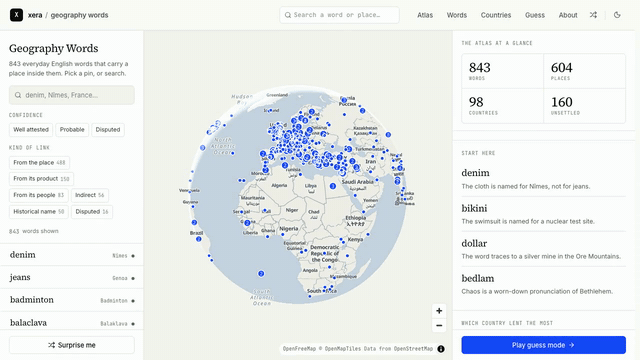

# Geography Words

A curated atlas of English words that carry a place inside them. Search *denim*
and the globe flies to Nîmes; open Bikini Atoll and the swimsuit is waiting
there.



<sub>The first two of nine words. [Watch the full 57 second tour](documentation/tour.mp4):
sandwich, jeans, jersey, marathon, Nokia, tuxedo, spa, peach and bikini, then
the dollar entry and guess mode.</sub>

<!-- stats -->
**843 words · 604 places · 98 countries** — 683 well attested, 128 probable, 32 disputed.
<!-- /stats -->

Every entry records what kind of link it is (named from the place, named for a product of it, from
its people, through a historical name, indirect, or disputed), how settled the
etymology is, a short explanation written for this atlas, and links to
Wiktionary and Wikidata. Dictionary prose is not copied into the database.

That headline is generated: `node scripts/atlas-stats.mjs` rewrites it from
`src/data/words.ts`, so it cannot drift out of date.

## Stack

- Next.js 16 (App Router, static export of every word/place/country page)
- MapLibre GL via react-map-gl, OpenFreeMap vector tiles
- Tailwind 4 plus the Xera design tokens shared with the OpenScience platform
- No database: the dataset lives in `src/data/words.ts`

## Routes

| Route | What it is |
|---|---|
| `/` | Landing: the reveal, stats, featured entries, league table |
| `/map` | Full-screen atlas with search, confidence filters and a detail rail |
| `/guess` | Guess mode: drop a pin, see the great-circle arc and the distance |
| `/words` | Every entry, filterable by confidence and relationship |
| `/word/[slug]` | One entry: chain, mini-map, record, sources, related |
| `/place/[slug]` | A place and the words pinned to it |
| `/countries`, `/country/[code]` | The league table and one country |
| `/about` | Method, confidence states, sources and licenses |

## Develop

```bash
npm install
npm run dev
```

## Build

```bash
NEXT_PUBLIC_SITE_URL=https://geowords.xera.ac npm run build
npm start            # serves on $PORT, default 3021
```

`NEXT_PUBLIC_SITE_URL` drives canonical URLs, the sitemap and Open Graph image
URLs, so it must be set at build time in production.

## Checks

```bash
npm run type-check
npm run lint
npm run validate:layers     # map expressions, against the MapLibre style spec
npm run validate:places     # every Wikidata id exists and agrees with the data
npm run validate:coverage   # every category member is published or declined
npm run test:e2e            # the atlas in a real browser
```

`validate:layers` exists because a bad map expression is invisible to
TypeScript and to `next build`: it fails inside MapLibre at runtime, dropping
the layer while everything around it still renders.

## The tour

```bash
npm run build && npx next start -p 3131 &
npm run tour                # writes documentation/tour.mp4 and tour.gif
```

Playwright drives the real page and records it, so the map flights in the video
are the ones a reader gets. It moves by hovering and clicking pins rather than
by navigating: a page load drops the map, flashes white and rebuilds the globe,
which reads as a stutter halfway through the video. The recording is 25fps and
is encoded without resampling, since forcing it to 30 duplicates every fifth
frame and shows up as judder on the flights.

The mp4 is the full tour; the gif is a short excerpt, because a whole tour at
gif frame rates runs to tens of megabytes.

## Data and licenses

Place identifiers and coordinates come from Wikidata (CC0). Candidate terms and
page links point at English Wiktionary (CC BY-SA 4.0 / GFDL). Map tiles are
OpenFreeMap, data © OpenStreetMap contributors (ODbL). Explanations,
relationship types and confidence labels are written for this atlas.
